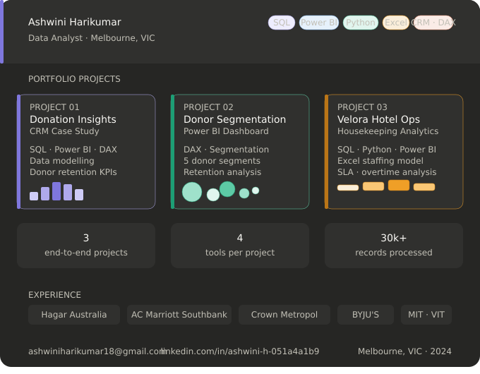

  

<h1 align="center">Ashwini Harikumar — Data Analyst Portfolio</h1>

  SQL · Power BI · Python · CRM Analytics · Data Cleaning · Dashboard Design

  <a href="https://www.linkedin.com/in/ashwini-h-051a4a1b9">LinkedIn</a> ·
  <a href="mailto:ashwiniharikumar18@gmail.com">Email</a> ·
  Melbourne, VIC

---

## 👩‍💻 About Me

I'm a Data Analyst with hands-on experience in CRM migration, SQL-based data validation, Power BI dashboard development, and operational analytics. My background spans non-profit fundraising data at Hagar Australia and hotel operations management at AC Marriott and Crown Metropol.

What makes my work different is that I bring domain expertise alongside technical skills. I don't just query data — I understand the operational context behind it, which means I know which metrics actually matter and why.

**What I do well:**
- Transform messy, high-volume datasets into clean, reporting-ready structures
- Build Power BI dashboards that answer real business questions — not just display numbers
- Write SQL that validates, reconciles, and profiles data, not just retrieves it
- Translate operational problems into analytical frameworks

---

## 📁 Portfolio Projects

---

### 🟦 1. Donation Insights — CRM Case Study
📂 [`/Donation-Insights-CRM-Case-Study`](./Donation-Insights-CRM-Case-Study)

**Problem:** Donation datasets lacked clear insights into donor retention, revenue trends, and giving patterns — making it difficult to target campaigns effectively.

**What I did:**
- Cleaned and validated raw donor and donation data using SQL
- Built a relational data model (donors ↔ donations — one-to-many)
- Developed a Power BI dashboard tracking revenue, repeat donor rate, and monthly trends
- Added geographic breakdown and KPI cards for executive reporting

**Key outputs:** SQL cleaning scripts · Power BI dashboard (.pbix) · Data model · Full documentation

**Skills:** SQL · Power BI · DAX · Data Modelling · CRM Analytics

---

### 🟪 2. Donor Segmentation Analysis
📂 [`/Donor-Segmentation-Analysis`](./Donor-Segmentation-Analysis)

**Problem:** The organisation couldn't identify which donor groups were driving the most revenue or which segments were at risk of lapsing — campaigns were sent to everyone equally.

**What I did:**
- Built segmentation logic in DAX to categorise donors by value, frequency, and recency
- Created KPI cards, distribution visuals, and behaviour analysis in Power BI
- Identified high-value, at-risk, new, recurring, and lapsed donor segments
- Delivered actionable insights to support targeted re-engagement campaigns

**Key outputs:** Segmentation DAX measures · Power BI dashboard (.pbix) · Behaviour analysis · Documentation

**Skills:** Power BI · DAX · Segmentation · KPI Reporting · Insight Storytelling

---

### 🏨 3. Velora Hotel — Housekeeping Operations Analytics
📂 [`/velora-hotel-housekeeping-analytics`](./velora-hotel-housekeeping-analytics)

**Problem:** As a Housekeeping Manager, I observed five recurring operational issues — uneven room allocation across floors, peak checkout bottlenecks, overtime blowouts, rooms not ready for check-in, and no visibility into individual staff productivity. There was no data infrastructure to diagnose or fix any of them.

**What I did:**
- Built a simulated operational dataset (4 CSVs, ~300 records) reflecting real housekeeping workflows
- Wrote 4 SQL files covering data exploration, checkout bottleneck analysis, overtime root cause analysis, and room readiness SLA tracking
- Built a Python notebook (pandas + matplotlib) with 5 charts and a findings summary
- Designed a 4-page Tableau dashboard tracking SLA compliance, overtime cost, and staffing KPIs
- Built an Excel staffing calculator using VLOOKUP and CEILING to recommend daily staff counts by floor — replacing flat allocation with a workload-weighted model

**Key findings:**
- 62% of overtime hours concentrated on Mondays and Fridays
- 10–11am checkout window drove 48% of all room clearance delays
- Room readiness SLA only being met 61% of the time (target: 85%)
- Floors 5 and 7 consistently over-allocated; Floors 1 and 2 under-utilised

**Key outputs:** 4 SQL analysis files · Python notebook with visualisations · Tableau dashboard (4 pages) · Excel staffing model (5-tab VLOOKUP/CEILING calculator) · Simulated CSV datasets

**Skills:** SQL (MySQL) · Python (pandas, matplotlib) · Tableau Public · Excel · Operational Analytics

---

## 🧰 Tools & Technologies

| Category | Tools |
|----------|-------|
| Querying & Validation | SQL (MySQL, PostgreSQL syntax) |
| Visualisation & BI | Power BI Desktop, DAX, Power Query, Tableau Public |
| Programming | Python (pandas, matplotlib, seaborn) |
| Spreadsheet Modelling | Excel (VLOOKUP, CEILING, conditional formatting) |
| CRM Platforms | Raisely, Funraise, Salesforce, HubSpot |
| Version Control | Git & GitHub |
| Data Concepts | Data modelling, ETL, segmentation, reconciliation, SLA analysis |

---

## 🔍 What You'll See Across These Projects

Every project in this portfolio follows the same structure:

**Problem → Data → Analysis → Insight → Recommendation**

I don't build dashboards for the sake of dashboards. Each project starts with a real operational or business problem, and the analysis exists to answer it. You'll find:

- SQL that profiles and validates before it queries
- Dashboards built around business questions, not available fields
- Python notebooks with a findings summary at the end, not just charts
- Documentation written for a non-technical reader, not just a developer

---

## 📫 Contact

Open to data analyst, CRM analyst, BI analyst, and junior data roles in Melbourne.

- **Email:** ashwiniharikumar18@gmail.com
- **LinkedIn:** [linkedin.com/in/ashwini-h-051a4a1b9](https://www.linkedin.com/in/ashwini-h-051a4a1b9)
- **Location:** Melbourne, VIC (open to hybrid and on-site)

---

  Thank you for visiting — I'm continuously adding new projects to this portfolio.

