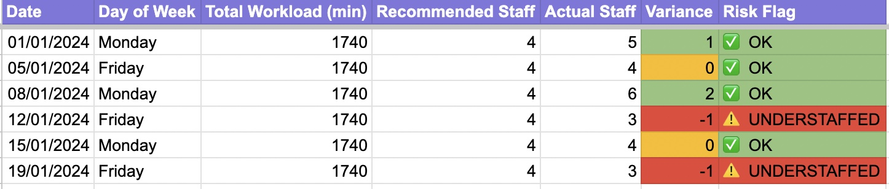
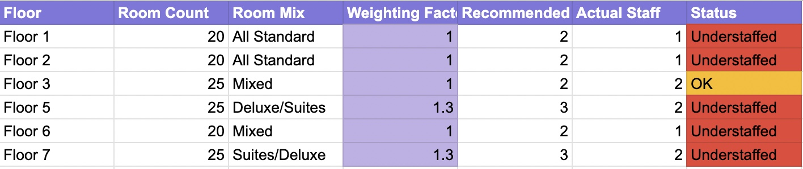

# Excel Staffing Model — Velora Hotel Melbourne

## Overview

The flat daily staffing approach at Velora Hotel was allocating the same number of housekeeping staff across all floors every day, regardless of actual checkout volume or room type mix. This created a predictable pattern — some staff finishing hours early while others ran into overtime on the same shift.

This Excel model was built to replace gut-feel rostering with a data-driven staffing calculator that accounts for room type, checkout volume, and floor-level workload differences.

---

## What Was Built

A 4-tab Google Sheets model that takes daily occupancy inputs and outputs a recommended staffing level per floor, with a risk flag for any day where actual allocation falls short.

**Tab 1 — Staffing Calculator**
Calculates total workload in minutes based on the number of suites, deluxe king, and standard rooms checking out that day. Uses a CEILING formula to convert total minutes into a recommended staff headcount, then compares it against actual staff allocated and flags understaffed days in red.

**Tab 2 — Floor Allocation**
Splits the recommended staff count across floors using a weighted formula. Floors 5 and 7 — which carry the highest concentration of suites and deluxe rooms — are assigned a 1.3x weighting factor because those room types take 30% longer to clean. This directly corrects the historical imbalance identified in the SQL analysis.

---

## Screenshots

### Staffing Calculator

### Floor Allocation

---

## Key Insight

The model revealed that under the previous flat allocation, Floors 5 and 7 were consistently under-resourced on high-checkout days. By applying a room-type weighting, the recommended staffing for those floors increased by one additional person — reducing the overtime blowouts that the SQL analysis had already flagged.

---

## Formulas Used

| Formula | Purpose |
|---------|---------|
| `VLOOKUP` | Look up clean time per room type from the standards table |
| `CEILING` | Round up staff count — you can't have half a person |
| `ROUND` | Weighted floor allocation based on room count and mix |
| `IF` | Risk flag — Understaffed, OK, or Overstaffed |
| `TEXT` | Auto-calculate day of week from date |

---

## Business Value

Replacing flat allocation with this model means a supervisor can enter the next day's expected checkouts in under 2 minutes and get a floor-by-floor staffing recommendation instantly — before the shift starts, not after overtime has already been clocked.

---

*Part of the Velora Hotel Housekeeping Analytics project by Ashwini Harikumar*
