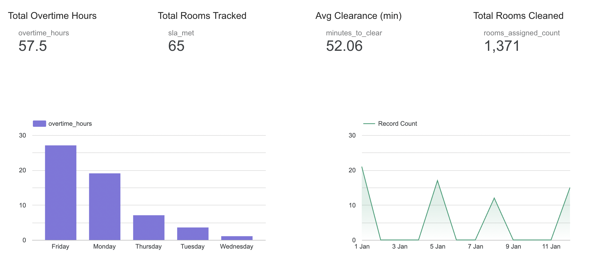
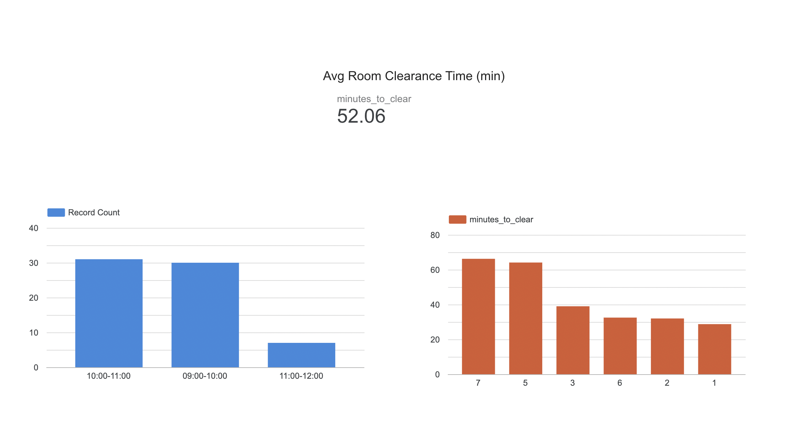
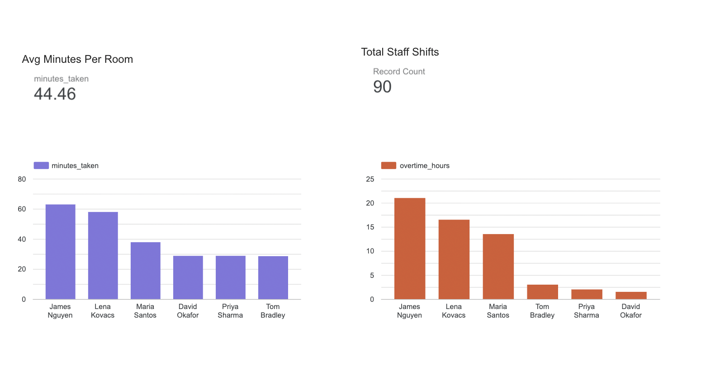
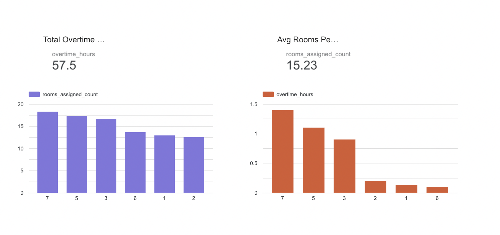

# Tableau Dashboard — Velora Hotel Melbourne

## Overview

The Tableau dashboard was built to give operations management a single view of housekeeping performance across the property — replacing the daily manual reporting that had no visibility into SLA compliance, overtime patterns, or floor-level workload imbalances.

All 4 CSV files from this project feed directly into the dashboard as data sources.

---

## Dashboard Pages

### Page 1 — Operations Overview
High-level KPI summary for management. Shows SLA compliance rate, total overtime hours, average room clearance time, and SLA failures as headline cards, with a daily SLA trend line and overtime by day of week bar chart.

### Page 2 — Checkout Bottleneck Analysis
Identifies the 10–11am checkout window as the core operational pressure point. Shows hourly checkout volume against average clearance time on a dual-axis chart, with SLA pass/fail breakdown by floor.

### Page 3 — Staff Productivity Tracker
Compares actual minutes per room against standard minutes for each staff member. Highlights which staff are consistently above standard time and which floors are driving the most overtime.

### Page 4 — Staffing Optimisation
Shows floor-level workload imbalance — average rooms assigned and average overtime by floor — against the daily average. Demonstrates that Floors 5 and 7 are consistently over-loaded while Floors 1 and 2 are under-utilised on the same shifts.

---

## Screenshots

### Page 1 — Operations Overview

### Page 2 — Checkout Bottleneck

### Page 3 — Staff Productivity

### Page 4 — Staffing Optimisation

---

## Key Metrics Visualised

| Metric | Source Table | Insight |
|--------|-------------|---------|
| SLA Compliance % | room_status_log | Only 61% of rooms ready before check-in |
| Overtime by day | staff_roster | 62% of OT on Mondays and Fridays |
| Clearance time by hour | checkout_log | 10–11am window is the bottleneck |
| Avg minutes vs standard | room_assignments | Top staff 35% faster than bottom quartile |
| Floor workload | staff_roster | Floors 5 and 7 consistently over-allocated |

---

## How to Connect the Data

1. Open **Tableau Public** (free download from public.tableau.com)
2. Click **Connect to Data → Text File**
3. Load all 4 CSV files from the `/data` folder
4. Build relationships between tables using `shift_date` and `room_number` as join keys

---

*Part of the Velora Hotel Housekeeping Analytics project by Ashwini Harikumar*
